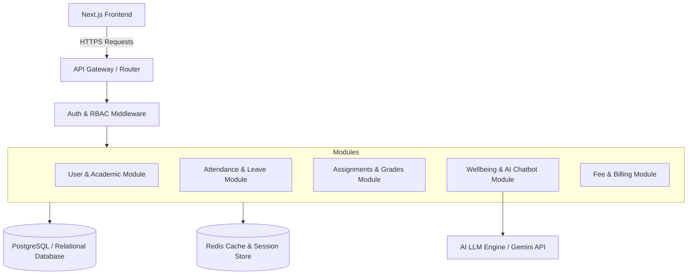
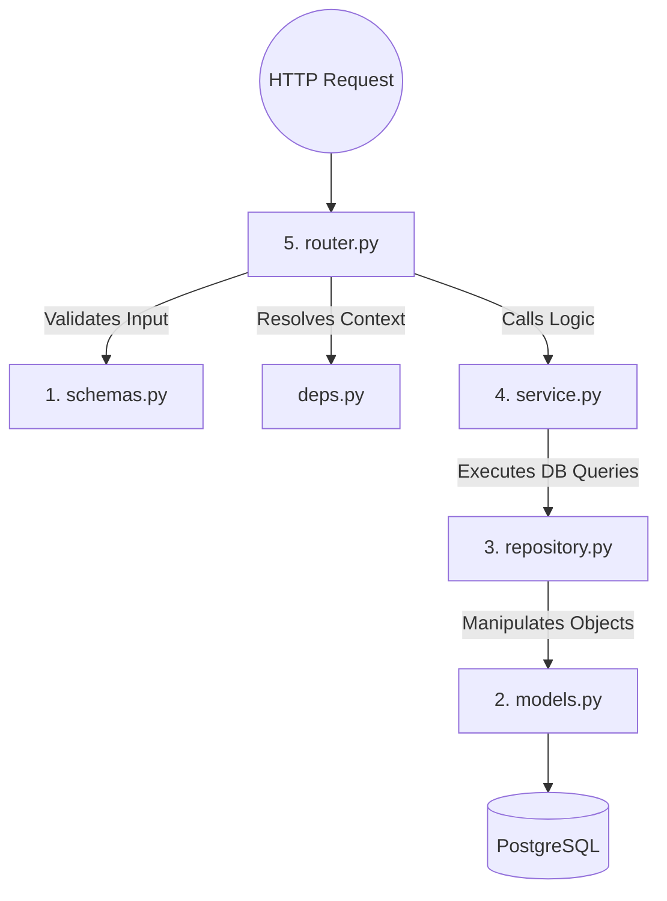
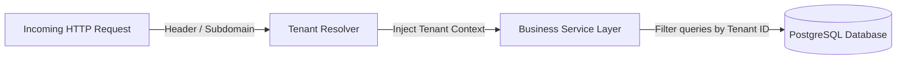
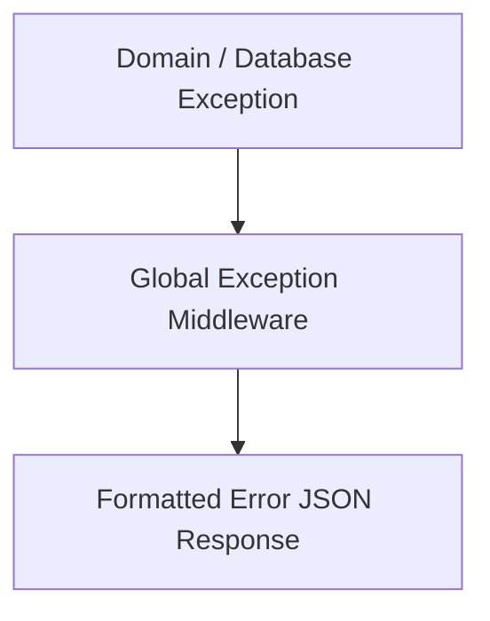
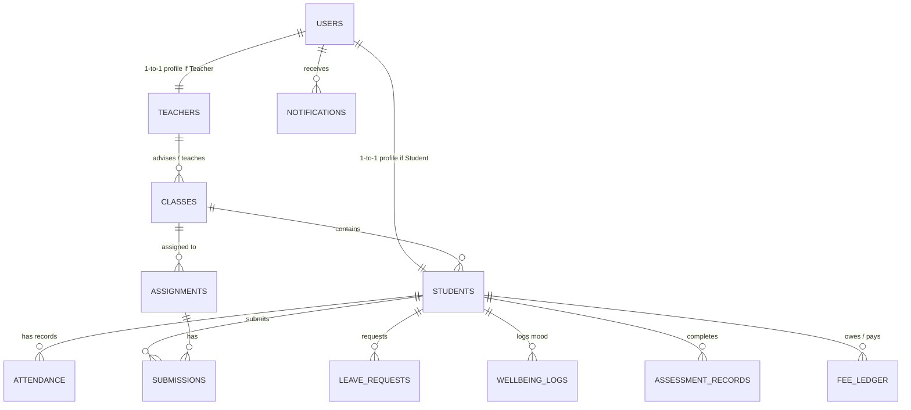
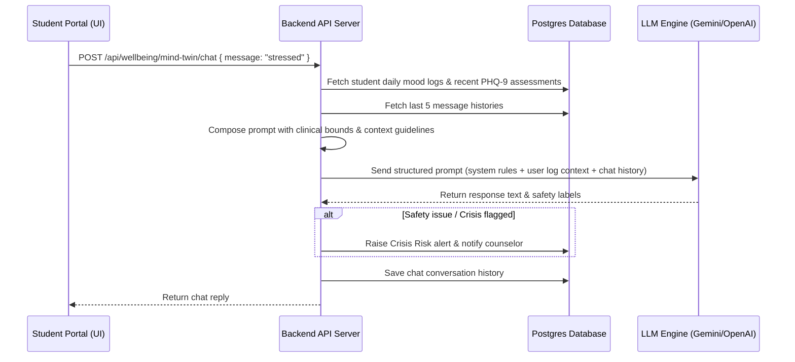

# Student Nexus: Backend Architecture & Module Specification

This document provides a comprehensive technical specification for the backend infrastructure required to power the **Student Nexus** (LearnOGrowth) frontend application. It maps the visual and interactive features found in the Next.js portal (for Students, Teachers, and Administrators) to backend modules, database schemas, APIs, and services.

---

## 1. Architectural Overview

The backend should be structured as a decoupled, secure **RESTful API** (or **GraphQL API**) service with a persistent database layer. To support role-based route guards and real-time operations, the backend needs:



### Recommended Technology Stack
*   **Application Server**: Python (with **FastAPI**) for high-performance, asynchronous, self-documenting APIs.
*   **Database**: **PostgreSQL** is highly recommended due to the relational nature of school entities (Students $\rightarrow$ Classes $\rightarrow$ Subjects $\rightarrow$ Assignments $\rightarrow$ Submissions).
*   **Caching & Session Store**: **Redis** for storing fast session keys, role cache, and temporary verification codes (OTP).
*   **AI Integration**: OpenAI SDK, Anthropic SDK, or Google Gemini API for the **Mind Twin AI** counseling feature.

---

## 2. Layering Rule — The Five Layers Architecture

Every business module in the application backend must conform to the same rigid layering pattern to maintain separation of concerns, testability, and clarity. 

### Folder Structure Convention
Modules must be contained under the `app/modules/{module_name}/` namespace:
```
app/modules/{name}/
  ├── __init__.py
  ├── router.py        # 5. HTTP Layer: Endpoint routing, input parameters, response codes
  ├── service.py       # 4. Business Logic: Computations, transactions, third-party services
  ├── repository.py    # 3. DB Access: SQLAlchemy queries, CRUD implementation
  ├── models.py        # 2. ORM Definitions: SQLAlchemy database models
  ├── schemas.py       # 1. Pydantic Boundary Types: Validation, serialization, deserialization
  └── deps.py          # Dependencies: FastAPI dependency providers (Auth, DB session, tenant)
```



### Layer Definitions

1.  **`schemas.py` (Pydantic Boundary Types)**
    *   Defines the data contract for incoming request payloads and outgoing response bodies.
    *   Performs structural verification, type coercion, and schema documentation for OpenAPI (Swagger).
    *   No database logic or execution is allowed here.
2.  **`models.py` (ORM Definitions)**
    *   Maps Python classes directly to database tables using SQLAlchemy.
    *   Defines primary keys, foreign keys, constraints, and relationships.
3.  **`repository.py` (DB Access)**
    *   The only layer allowed to construct database queries and interface directly with SQLAlchemy session contexts.
    *   Exposes clean methods (e.g. `get_student_by_id`, `list_active_teachers`) to abstract raw query complexity from business services.
4.  **`service.py` (Business Logic)**
    *   Implements the core logic of the application (e.g., checking if attendance drops below thresholds, grading evaluations, communicating with AI platforms).
    *   Responsible for controlling database transaction lifecycles.
5.  **`router.py` (HTTP Layer)**
    *   Defines HTTP endpoints (e.g., `@router.post("/login")`).
    *   Translates query/path inputs to services, invokes security middleware, handles exceptions, and returns responses.
6.  **`deps.py` (Dependencies)**
    *   Houses dependency injection factories, such as retrieving the current authenticated user context, checking active authorization privileges, or retrieving a database session connection pool.

---

## 3. Multi-Tenancy Strategy

To support multiple educational institutions (schools) within the same database ecosystem, the platform implements a **Shared Database, Shared Schema** tenancy model.



### Implementation Rules
1.  **Discriminator Column**: Every tenant-owned database table (e.g. Students, Teachers, Classes, Attendance, Invoices) must contain a `tenant_id` field.
2.  **Tenant Context Injection**:
    *   The `deps.py` file resolves the current active tenant during request inspection by checking either a custom header (e.g. `X-Tenant-ID`), the host subdomain (e.g. `school-a.nexus.edu`), or JWT claims.
    *   An active `tenant_id` is then bound to the FastAPI request context.
3.  **Automatic Query Filtering**:
    *   Every database query executed through the Repository layer must enforce the tenant condition (e.g., `WHERE tenant_id = :active_tenant_id`) to block cross-tenant information leaks.
    *   No data should be updated, read, or deleted without verifying ownership context.

---

## 4. Async Operations & Transactions

To guarantee both scalability under heavy API loads and transaction safety (ACID compliance), the backend strictly follows async patterns and session state rules.

### Asynchronous Operations
*   All I/O operations (HTTP endpoints, database queries, external integrations like LLMs) must use Python's `async` and `await` directives to prevent blocking the single-threaded event loop.
*   Background workflows that do not require an immediate response (e.g. sending attendance alert emails, recording logs) are delegated to FastAPI's built-in `BackgroundTasks` queue or an external task worker system.

### Transaction Management
*   Database connections are requested on demand using SQLAlchemy's asynchronous session handlers (`AsyncSession`).
*   Transaction lifecycles are controlled inside the **Service** layer to ensure multi-step logic (e.g. deducting fee payment and updating student billing ledger statuses) is treated atomically.
*   **Code Example**:
    ```python
    # service.py
    async def process_payment(self, db_session: AsyncSession, student_id: str, payment_data: PaymentSchema):
        async with db_session.begin():  # Initiates a transaction block
            # 1. Save payment ledger entry
            payment = await self.payment_repo.create_entry(db_session, student_id, payment_data)
            # 2. Update outstanding balance
            await self.student_repo.update_ledger_balance(db_session, student_id, payment.amount)
            # Both statements commit atomically. If either fails, the system rolls back.
    ```

---

## 5. Database Migrations (Alembic)

Database schema evolution is managed using **Alembic**, SQLAlchemy's official migration tool. All structural alterations to the PostgreSQL schema must go through versioned migration scripts rather than manual direct SQL modifications.

### Environment & Configuration
*   **Location**: Alembic configuration files reside in the root directory under the `alembic/` folder (containing `env.py`, `script.py.mangled`, and the `versions/` subdirectory).
*   **Asynchronous Engine Configuration**: In `alembic/env.py`, configuration must utilize `run_migrations_online` over an async database engine helper to prevent blocking event loop execution:
    ```python
    # alembic/env.py
    import asyncio
    from sqlalchemy.ext.asyncio import create_async_engine

    def run_migrations_online() -> None:
        connectable = create_async_engine(get_database_url())
        # ... async runner logic calling context.configure()
    ```
*   **Target Metadata Auto-detection**: Import all ORM class definitions (`app/modules/*/models.py`) inside `alembic/env.py` and bind them to the base target metadata to support SQL autogeneration:
    ```python
    from app.db.base_class import Base  # imports all submodels
    target_metadata = Base.metadata
    ```

### Command Conventions
*   **Create Migration**: Whenever database models are added or modified, generate an autogenerated revision script:
    ```bash
    alembic revision --autogenerate -m "add_student_attendance_rate"
    ```
*   **Apply Migrations**: Upgrade the target database schema to the latest version:
    ```bash
    alembic upgrade head
    ```
*   **Rollback Migration**: Downgrade the schema by one revision step:
    ```bash
    alembic downgrade -1
    ```

---

## 6. Error Handling & Standard Responses

The backend implements a unified global exception handling pipeline to translate server failures into structured, helpful JSON payloads for the Next.js frontend.



### Standardized Error Payload Format
Whenever an error occurs, the server responds with a clear HTTP error code and a standard JSON payload:
```json
{
  "success": false,
  "error_code": "RESOURCE_NOT_FOUND",
  "message": "Student record with ID ST-003 was not found.",
  "details": {
    "student_id": "ST-003"
  }
}
```

### Custom Exception Hierarchy
1.  **Base Class (`AppException`)**:
    An application exception class extending `Exception`, containing:
    *   `status_code` (HTTP status code, e.g. `404`)
    *   `error_code` (internal system string error identifier)
    *   `message` (human-readable string detail)
    *   `details` (optional helper payload for developers/UI debuggers)
2.  **Domain-Specific Inheritors**:
    *   `CredentialsMismatchException` $\rightarrow$ `401 Unauthorized`
    *   `ResourceNotFoundException` $\rightarrow$ `404 Not Found`
    *   `CrisisAlertTriggered` $\rightarrow$ `403 Forbidden`
    *   `ValidationFailedException` $\rightarrow$ `422 Unprocessable Entity`
3.  **Global Handler Interception**:
    FastAPI utilizes custom exception handlers to catch `AppException` automatically and format JSON outputs directly. Any unhandled server exceptions are caught, logged with trace details, and returned to client channels as a safe, generic `500 Internal Server Error` message.

---

## 7. Core Backend Modules Specification

Based on the frontend components, the backend must implement the following 9 modules:

### 7.1. Authentication & Role-Based Access Control (RBAC) Module
Responsible for validating credentials, managing active sessions, and ensuring users only access authorized paths (as guarded by the frontend `src/proxy.ts` middleware).
*   **Authentication Flow**: Support credentials-based login and Single Sign-On (SSO).
*   **Role Management**: Map users to one of three roles: `student`, `teacher`, or `admin`.
*   **OTP & Verification**: Generate and verify short-lived OTP tokens for password resets and verification procedures.
*   **Session Management**: Issue HTTP-only, secure, same-site JWT cookies (`nexus-role` and auth tokens).

### 7.2. Student Management Module
Handles student profile information, academic records, and status logs.
*   **Profile Management**: Serve personal details (name, email, parent contact, registration IDs).
*   **Academic Dashboard Stats**: Aggregate student GPA, class standings, and total course enrollment lists.

### 7.3. Teacher Portal Module
Exposes classrooms, mapped subjects, and roster details to designated instructors.
*   **Class/Roster Retrieval**: Provide rosters of students assigned to a teacher's classes.
*   **Performance Metrics**: Aggregate academic analytics for specific classes.

### 7.4. Class & Course Allocation Module (Admin)
Handles master configuration tables for grades, subjects, sections, and allocations.
*   **Subject & Teacher Mapping**: Assign teachers to courses and link courses to specific grades/sections.
*   **Class Master Details**: Handle CRUD for classes (e.g., "10th-A", "11th-B").

### 7.5. Attendance & Leave Tracker Module
Facilitates attendance entry and student leave requests.
*   **Attendance Ledger**: API for teachers to submit daily present/absent logs.
*   **Leave Application Workflow**: 
    *   Students can submit leave requests (Medical, Personal, Emergency).
    *   Teachers can view pending applications, approve, or reject them.
*   **Analytics Engine**: Compute historical attendance metrics (weekly/monthly charts) and trigger warning alerts if a student's attendance drops below a certain threshold (e.g., 75%).

### 7.6. Assignments & Grading Module
Manages student homework lists, file uploads, and class evaluation details.
*   **Assignment Registry**: Allow teachers to publish details, instructions, total marks, and due dates.
*   **Submissions Pipeline**: Capture student answers (file links/notes) and compute deadlines to mark submissions as *Pending*, *Submitted*, *Graded*, or *Late*.
*   **Grading Matrix**: Let instructors score assignments and input feedback.

### 7.7. Senior Student Wellbeing & Mental Health Module
Specifically designed for senior grades (10th, 11th, and 12th). 
*   **Daily Check-In Tracker**: Store daily records for a student's mood (Struggling, Okay, Good, Great), sleep duration (hours), and energy levels (Low, Medium, High).
*   **Screener Assessment Storage**: Save historical scores of clinical questionnaires (PHQ-9 Depression Screener, GAD-7 Anxiety Screener, Academic Burnout).
*   **Risk Categorization Engine**:
    *   Assess logs and scores to determine a student's mental health status: `Stable`, `Elevated Stress`, or `Crisis Risk`.
    *   Expose high-risk alerts to teachers and counselors immediately.
*   **Mind Twin AI Coordinator**: API endpoint providing contextual history to a secure LLM, acting as a supportive counseling chatbot.

### 7.8. Fees & Billing Management Module (Admin)
Facilitates tracking of school finances, dues, and payment records.
*   **Fee Ledger**: Record term fees, outstanding balances, partial payments, and overdue bills.
*   **Collection Analytics**: Provide aggregated monthly collection trends (Collected vs. Pending) to feed admin dashboard bar charts.

### 7.9. Notification & Dispatch Module
Pushes real-time alerts to the client dashboard based on system actions.
*   **Trigger Events**: New assignment posted, leave approved/rejected, attendance warning issued, high clinical screener scores logged (for counselor/teacher notification).

---

## 8. Database Schema Design (Entity-Relationship)

Here is a recommended SQL database schema to support the above modules, normalized for a PostgreSQL environment:



### Table Structure Definitions

#### 1. `users`
Represents core identity records for security and login validation.
```sql
CREATE TABLE users (
    id UUID PRIMARY KEY DEFAULT gen_random_uuid(),
    name VARCHAR(100) NOT NULL,
    email VARCHAR(150) UNIQUE NOT NULL,
    password_hash VARCHAR(255) NOT NULL,
    role VARCHAR(20) NOT NULL CHECK (role IN ('student', 'teacher', 'admin')),
    avatar_url VARCHAR(255),
    created_at TIMESTAMP DEFAULT CURRENT_TIMESTAMP,
    updated_at TIMESTAMP DEFAULT CURRENT_TIMESTAMP
);
```

#### 2. `teachers`
Holds employee-specific records.
```sql
CREATE TABLE teachers (
    id UUID PRIMARY KEY DEFAULT gen_random_uuid(),
    user_id UUID UNIQUE NOT NULL REFERENCES users(id) ON DELETE CASCADE,
    employee_id VARCHAR(50) UNIQUE NOT NULL, -- e.g. EMP-001
    subject VARCHAR(100) NOT NULL,           -- Primary subject taught
    department VARCHAR(100) NOT NULL,        -- e.g. Science, Humanities
    created_at TIMESTAMP DEFAULT CURRENT_TIMESTAMP
);
```

#### 3. `classes`
Represents classrooms (grades and sections).
```sql
CREATE TABLE classes (
    id UUID PRIMARY KEY DEFAULT gen_random_uuid(),
    grade VARCHAR(20) NOT NULL,          -- e.g. '10th', '11th'
    section VARCHAR(10) NOT NULL,        -- e.g. 'A', 'B'
    adviser_id UUID REFERENCES teachers(id) ON DELETE SET NULL,
    UNIQUE (grade, section)
);
```

#### 4. `students`
Holds academic details and references to classes.
```sql
CREATE TABLE students (
    id UUID PRIMARY KEY DEFAULT gen_random_uuid(),
    user_id UUID UNIQUE NOT NULL REFERENCES users(id) ON DELETE CASCADE,
    student_id VARCHAR(50) UNIQUE NOT NULL,  -- e.g. ST-001
    class_id UUID NOT NULL REFERENCES classes(id),
    roll_no VARCHAR(20) NOT NULL,
    gpa NUMERIC(3, 2) DEFAULT 0.00,
    attendance_rate NUMERIC(5, 2) DEFAULT 100.00, -- Computed periodically
    status VARCHAR(20) DEFAULT 'Active' CHECK (status IN ('Active', 'Warning', 'Inactive')),
    parent_name VARCHAR(100) NOT NULL,
    parent_email VARCHAR(150),
    created_at TIMESTAMP DEFAULT CURRENT_TIMESTAMP
);
```

#### 5. `attendance`
Stores the daily attendance check ledger.
```sql
CREATE TABLE attendance (
    id UUID PRIMARY KEY DEFAULT gen_random_uuid(),
    student_id UUID NOT NULL REFERENCES students(id) ON DELETE CASCADE,
    date DATE NOT NULL,
    status VARCHAR(15) NOT NULL CHECK (status IN ('Present', 'Absent', 'Leave')),
    marked_by UUID REFERENCES users(id),
    created_at TIMESTAMP DEFAULT CURRENT_TIMESTAMP,
    UNIQUE (student_id, date)
);
```

#### 6. `assignments`
Lists published homework.
```sql
CREATE TABLE assignments (
    id UUID PRIMARY KEY DEFAULT gen_random_uuid(),
    class_id UUID NOT NULL REFERENCES classes(id) ON DELETE CASCADE,
    teacher_id UUID NOT NULL REFERENCES teachers(id) ON DELETE CASCADE,
    title VARCHAR(150) NOT NULL,
    description TEXT,
    due_date TIMESTAMP NOT NULL,
    total_marks INTEGER NOT NULL DEFAULT 100,
    created_at TIMESTAMP DEFAULT CURRENT_TIMESTAMP
);
```

#### 7. `submissions`
Tracks student uploads and grades for assignments.
```sql
CREATE TABLE submissions (
    id UUID PRIMARY KEY DEFAULT gen_random_uuid(),
    assignment_id UUID NOT NULL REFERENCES assignments(id) ON DELETE CASCADE,
    student_id UUID NOT NULL REFERENCES students(id) ON DELETE CASCADE,
    submission_date TIMESTAMP DEFAULT CURRENT_TIMESTAMP,
    file_url VARCHAR(255),
    student_notes TEXT,
    marks_awarded INTEGER,
    status VARCHAR(20) DEFAULT 'Pending' CHECK (status IN ('Pending', 'Submitted', 'Graded', 'Late')),
    graded_by UUID REFERENCES teachers(id),
    graded_at TIMESTAMP,
    UNIQUE (assignment_id, student_id)
);
```

#### 8. `leave_requests`
Maintains leave application workflows.
```sql
CREATE TABLE leave_requests (
    id UUID PRIMARY KEY DEFAULT gen_random_uuid(),
    student_id UUID NOT NULL REFERENCES students(id) ON DELETE CASCADE,
    type VARCHAR(20) NOT NULL CHECK (type IN ('Medical', 'Personal', 'Emergency')),
    from_date DATE NOT NULL,
    to_date DATE NOT NULL,
    reason TEXT NOT NULL,
    status VARCHAR(20) DEFAULT 'Pending' CHECK (status IN ('Pending', 'Approved', 'Rejected')),
    reviewed_by UUID REFERENCES teachers(id),
    review_notes TEXT,
    created_at TIMESTAMP DEFAULT CURRENT_TIMESTAMP
);
```

#### 9. `wellbeing_logs`
Saves daily check-in logs for mood charting.
```sql
CREATE TABLE wellbeing_logs (
    id UUID PRIMARY KEY DEFAULT gen_random_uuid(),
    student_id UUID NOT NULL REFERENCES students(id) ON DELETE CASCADE,
    date DATE NOT NULL DEFAULT CURRENT_DATE,
    mood_emoji VARCHAR(10) NOT NULL,       -- 😔, 😐, 🙂, 😁
    mood_score INTEGER NOT NULL CHECK (mood_score BETWEEN 1 AND 4), -- 1: Struggling, 4: Great
    sleep_hours NUMERIC(4, 2) NOT NULL,
    energy_level VARCHAR(15) NOT NULL CHECK (energy_level IN ('Low', 'Medium', 'High')),
    created_at TIMESTAMP DEFAULT CURRENT_TIMESTAMP,
    UNIQUE (student_id, date)
);
```

#### 10. `assessment_records`
Stores results from clinical questionnaires (PHQ-9, GAD-7, Burnout).
```sql
CREATE TABLE assessment_records (
    id UUID PRIMARY KEY DEFAULT gen_random_uuid(),
    student_id UUID NOT NULL REFERENCES students(id) ON DELETE CASCADE,
    assessment_type VARCHAR(50) NOT NULL, -- 'PHQ-9', 'GAD-7', 'BURNOUT'
    score INTEGER NOT NULL,
    completed_at TIMESTAMP DEFAULT CURRENT_TIMESTAMP
);
```

#### 11. `fee_ledger`
Manages invoice payments.
```sql
CREATE TABLE fee_ledger (
    id UUID PRIMARY KEY DEFAULT gen_random_uuid(),
    student_id UUID NOT NULL REFERENCES students(id) ON DELETE CASCADE,
    term_name VARCHAR(50) NOT NULL, -- e.g., 'Term 1 2025'
    amount NUMERIC(10, 2) NOT NULL,
    paid NUMERIC(10, 2) DEFAULT 0.00,
    status VARCHAR(20) DEFAULT 'Pending' CHECK (status IN ('Paid', 'Pending', 'Partial', 'Overdue')),
    due_date DATE NOT NULL,
    paid_date DATE,
    created_at TIMESTAMP DEFAULT CURRENT_TIMESTAMP
);
```

#### 12. `notifications`
Supports notification alerts.
```sql
CREATE TABLE notifications (
    id UUID PRIMARY KEY DEFAULT gen_random_uuid(),
    user_id UUID NOT NULL REFERENCES users(id) ON DELETE CASCADE,
    title VARCHAR(200) NOT NULL,
    message TEXT NOT NULL,
    type VARCHAR(20) DEFAULT 'info' CHECK (type IN ('info', 'success', 'warning', 'error')),
    read BOOLEAN DEFAULT FALSE,
    created_at TIMESTAMP DEFAULT CURRENT_TIMESTAMP
);
```

---

## 9. API Endpoints Specification

Here is the primary API routing list mapping frontend functionalities to controller logic. All routes except `/api/auth/login` require an authenticated session token header/cookie.

### 9.1. Auth Module (`/api/auth`)
*   `POST /api/auth/login` - Authenticate credentials, issue cookie with `nexus-role`.
*   `POST /api/auth/logout` - Invalidate credentials, clear cookie.
*   `POST /api/auth/forgot-password` - Request OTP verification via email.
*   `POST /api/auth/otp-verify` - Verify correctness of OTP check.
*   `POST /api/auth/reset-password` - Update the user password if verification was successful.

### 9.2. Student Module (`/api/student`)
*   `GET /api/student/dashboard` - Return attendance percentages, recent grades, upcoming assignments, and recent notifications.
*   `GET /api/student/profile` - Retrieve individual student data.
*   `GET /api/student/assignments` - Fetch list of assignments assigned to the student's class, with submission statuses.
*   `POST /api/student/assignments/:id/submit` - Upload solution (text/file URL).
*   `GET /api/student/attendance` - Obtain daily historical logs and weekly trends.
*   `GET /api/student/leave` - Fetch student's leave requests.
*   `POST /api/student/leave` - Apply for a new leave request.

### 9.3. Teacher Module (`/api/teacher`)
*   `GET /api/teacher/dashboard` - Return counts of classes, active students, pending assignments, and pending leave approvals.
*   `GET /api/teacher/students` - List all students assigned to the teacher's classes.
*   `GET /api/teacher/attendance` - Fetch class attendance logs.
*   `POST /api/teacher/attendance` - Record attendance for a class on a specific date.
*   `GET /api/teacher/assignments` - List assignments created by the teacher.
*   `POST /api/teacher/assignments` - Create a new assignment.
*   `POST /api/teacher/assignments/:id/grade` - Score a student's submission.
*   `GET /api/teacher/leave-approvals` - Retrieve list of student leave applications.
*   `PATCH /api/teacher/leave-approvals/:id` - Approve or reject a leave application.

### 9.4. Wellbeing Module (`/api/wellbeing`)
*   `POST /api/wellbeing/daily-log` - Save daily mood, sleep, and energy logs.
*   `GET /api/wellbeing/mood-history` - Fetch student's historical mood logs for chart rendering.
*   `POST /api/wellbeing/assessment` - Submit PHQ-9, GAD-7, or Burnout score results.
*   `GET /api/wellbeing/insights` - (Teachers only) Fetch student wellbeing indicators (mood, sleep average, assessment status, warning levels) for classrooms.
*   `POST /api/wellbeing/mind-twin/chat` - Chat with the AI Mind Twin.

### 9.5. Fees Module (`/api/admin/fees`)
*   `GET /api/admin/fees/summary` - Aggregated financial analytics (Total collected, pending, overdue counts).
*   `GET /api/admin/fees/records` - List invoice records with filter parameters (Paid, Pending, Partial, Overdue).
*   `POST /api/admin/fees/record-payment` - Update payment records when a payment is processed.

---

## 10. Mind Twin AI Chatbot Architecture

The **Mind Twin AI** is a critical component of the platform, requiring special design to ensure strict confidentiality, student safety, and helpful contextual support.



### Safety & Compliance Rules
1. **Crisis Detection Pre-Processing**: If the model or custom string matching detects trigger words (self-harm, depression, severe crisis), the backend should trigger a system flag, updating the student's status to `Crisis Risk` and triggering notifications for the class teacher and school counselor.
2. **Contextual Injection**: The backend retrieves the student's logged metrics (e.g., mood, sleep averages) to pass as context (e.g., *"System context: Student logged 'Struggling' mood today and slept 5 hours. Respond empathetically and suggest stress-management techniques"*).
3. **Data Anonymization**: Protect student privacy by stripping personally identifiable details (PII) before forwarding inputs to public external APIs, or hosting a local model (e.g., Llama 3) for processing inside a secure cloud instance.
